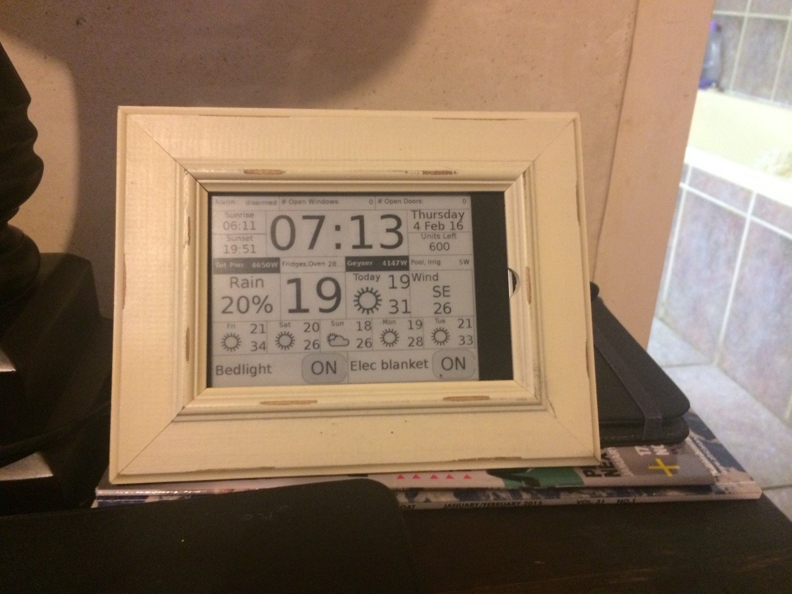

# qok
A custom openhab e-ink display using python and Qt 

I thought I would share what I have done in terms of using my kobo touch as the dispay interface to openhab

I hacked the Kobo with a debian image and used python and qt quick as the language and ui frameworks respectively.

The Kobo gets data from openhab via REST and display some of the data available. It also has buttons that can be pressed to switch on bedlights, etc linked to my home automation system.

Im displaying the following information retrieved from openhab:
- alarm state and open windows and doors
- sunrise and sunset times
- time and date
- electricity units left in the meter
- Energy power - total, fridges, geyser, pool, irrigation.
- chance of rain, current temperature [from sensors in the house]
- forecast temperature for today
- wind today
- weekly weather forecast
- state of my bedlight and electric blanket as button which can switch them on/off as well.

Ive added the app called QOK [Qt on Kobo - how original!! ] to the awesome menu.
Ive also added UsbNet to the menu, although I use wifi at home.

Screenshot:

